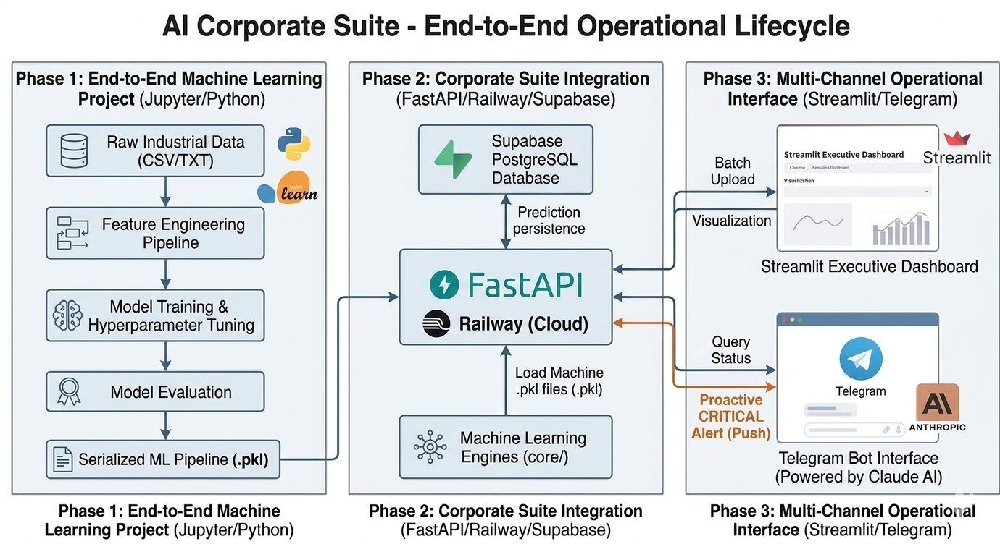

# 🚀 AI Corporate Suite
**Industrial Intelligence Platform: From Raw Data to Operational Reality**

### 🌐 Live Ecosystem
- **Executive Dashboard (UI):** [Live Suite](https://ui-production-a2ba.up.railway.app)
- **Interactive API Control (Swagger):** [Production API Docs](https://api-production-dd2a.up.railway.app/docs)
- **Direct Support:** [Telegram Bot](https://t.me/TuBotUser) *(Proactive Monitoring)*

---

# 🏗️ Architecture & Flow



The platform follows a modern, decoupled architecture:
1. **Frontend (Streamlit):** Executive reporting and manual uploads.
2. **Backend (FastAPI):** High-performance inference engine with multithreaded services.
3. **Persistence (Supabase):** PostgreSQL storage for batch tracking and historical auditing.

**The Data Lifecycle:**
`Raw Data Upload` ➔ `Schema Validation` ➔ `Machine Learning Inference` ➔ `DB Persistence` ➔ `Proactive Alerting` ➔ `Dashboard Refresh`

---

# 🔭 Perspective: The Operational Bridge
Most AI projects remain as isolated Jupyter Notebooks. **AI Corporate Suite** is a production-grade bridge that connects Data Science with industrial operations. 

This platform doesn't just "predict"; it **monitors, persists, and alerts**. It is a decoupled ecosystem (FastAPI + Streamlit + Supabase) designed to transform raw sensor and retail data into immediate executive action.

### 🧩 Applied AI Modules
The platform currently includes three applied AI modules that also exist as standalone projects separately:

- **SmartPort** — Maritime operational risk prediction
    - [Standalone Project Repository](https://github.com/robertofernandezmartinez/smartport-ai-risk-early-warning)
- **Stockout** — Retail inventory stockout prediction
    - [Standalone Project Repository](https://github.com/robertofernandezmartinez/retail-stockout-risk-scoring)
- **NASA RUL** — Predictive maintenance and Remaining Useful Life estimation
    - [Standalone Project Repository](https://github.com/robertofernandezmartinez/cmapss-rul-prediction)

---

# 🛠️ Core Capabilities
This repository demonstrates how machine learning models are transformed into an **Operational AI Platform**. The system empowers users and operators to:

* **Ingest & Validate:** Upload raw datasets through a web interface with real-time schema validation (Guardrails).
* **Trigger Inference:** Execute machine learning predictions through a dedicated, professional-grade REST API.
* **Cloud Persistence:** Automatically store every prediction and metadata in a Supabase (PostgreSQL) cloud database.
* **Historical Analysis:** Monitor and audit past performance through specialized executive dashboards.
* **Proactive Monitoring:** Receive instant push notifications on Telegram when the engine detects **CRITICAL** industrial risks.
* **Conversational Control:** Query system status and interact with the AI modules via a multi-channel Telegram Bot.
* **Automated Maintenance:** Run scheduled scripts for demo data reloading and automatic cleanup of old prediction batches.

> This project is a blueprint for integrating isolated ML notebooks into a scalable, multi-service production ecosystem.

---

# ⚡ Why this project matters (Value Proposition)

### 🔔 Proactive Intelligence
The system is **active, not passive**. When data is uploaded, the engines run inference in milliseconds. If a **CRITICAL** risk is detected, the system pushes an automated alert to the **Telegram Bot**. No one needs to be staring at a dashboard to know that an engine is failing or a warehouse is empty.

### 🛡️ Production-Ready Guardrails
Built for the "real world" where data is messy. Every engine includes a **Data Guardrail** layer that validates CSV schemas before inference. If the input is corrupt or columns are missing, the API rejects it with clear technical feedback instead of crashing.

### 🤖 Multi-Channel Interface
- **Streamlit UI:** Specialized dashboards for deep-dive historical analysis.
- **FastAPI Swagger:** A professional technical interface for external system integration.
- **Telegram Bot:** A conversational bridge for quick status checks and real-time push alerts.

---

# 🚀 Quick Start for Recruiters
1. **Open the [Interactive API Docs](/docs).**
2. Select a module, for example: `POST /stockout/upload`.
3. Click **"Try it out"** and upload a [Demo CSV](data/raw/).
4. Click **"Execute"**: You will receive a structured JSON response and a Telegram push notification in real-time.

---

# 📂 Project Structure
```text
ai-corporate-suite/
├── telegram_bot.py         # Root: Background bot service (Multithreaded)
├── main.py                 # FastAPI: API entrypoint & documentation
├── core/                   # ML Predictors: Specialized inference logic
│   ├── stockout_predictor.py
│   ├── smartport_predictor.py
│   └── nasa_predictor.py
├── models/                 # Serialized ML Pipelines (.pkl)
├── data/raw/               # Valid demo datasets for instant testing
├── db/                     # Cloud database integration
├── pages/                  # Streamlit modular dashboards
└── suite_streamlit.py      # Main Dashboard entrypoint
```
---

# 🛠️ Local Installation

```bash
# 1. Clone & Setup
git clone [https://github.com/robertofernandezmartinez/ai-corporate-suite.git](https://github.com/robertofernandezmartinez/ai-corporate-suite.git)
cd ai-corporate-suite
pip install -r requirements.txt

# 2. Configure Environment
# Create a .env file with your SUPABASE, TELEGRAM, and ANTHROPIC keys.

# 3. Launch Services
uvicorn main:app --reload        # Start API
streamlit run suite_streamlit.py # Start UI
```

---

# 👨‍💻 Author
**Roberto Fernández** - Industrial AI & Data Engineering  
[LinkedIn](https://www.linkedin.com/in/robertofernandezmartinez/) | [Portfolio](https://github.com/robertofernandezmartinez)